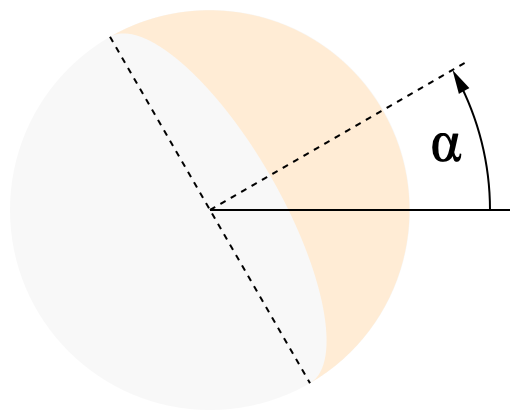

# Customization Guide

This guide describes how to use the additional attributes provided by this
extensions in skins.

## Contents

* [Customization of WeeWX using this extension](#customization-of-weewx-using-this-extension)
  * [General attributes](#general-attributes)
  * [Date and time](#date-and-time)
  * [Calendar events](#calendar-events)
  * [Heavenly bodies](#heavenly-bodies)
  * [`genVisibleTimespans()`](#genVisibleTimespans)
  * [Earth satellites](#earth-satellites)
  * [Maps](#maps)
  * [Coordinate systems](#coordinate-systems)
  * [Units](#units)
    * [Angles](#angles)
    * [Distances](#distances)
  * [Localization](#localization)
  * [How to check whether this extension is available?](#how-to-check-whether-this-extension-is-available)
* [Base data for calculation](#base-data-for-calculation)
  * [Time scales](#time-scales)
  * [Ephemerides](#ephemerides)
  * [Apparent sizes](#apparent-sizes)
  * [Earth satellites and space debris orbital data](#earth-satellites-and-space-debris-orbital-data)
  * [Stars](#stars)

## Customization of WeeWX using this extension

See the WeeWX customization guide, section "The Cheetah generator",
sub-section
"[Almanac](http://weewx.com/docs/latest/custom/cheetah-generator/#almanac)",
for a detailed description how to use the almanac in WeeWX. This section
repeats some of that information and adds, what is specific to this
extension.

The general syntax is:

```
$almanac(almanac_time=time,            ## Unix epoch time
         lat=latitude, lon=longitude,  ## degrees
         altitude=altitude,            ## meters
         pressure=pressure,            ## mbars
         horizon=horizon,              ## degrees
         temperature=temperature_C     ## degrees C
       ).heavenly_body(use_center=[01]).attribute
```

If `almanac_time` is not specified, the actual time as returned by
`$current.dateTime` is used. For some attributes `almanac_time`
can take a list of timestamps.

Latitude and longitude refer to the WGS84 ellipsoid as used by GPS.
If `lat` and `lon` are not specified, the location of the station is used.

### General attributes

General attributes do not require a heavenly body. They provide general
information or are shortcuts for other attributes.

Attribute | Data type | Meaning
----------|-----------|---------
`hasExtras` | bool | becomes `True` after initialization is finished
`sunrise` | `group_time` | shortcut for `$almanac.sun.rise`
`sunset` | `group_time` | shortcut for `$almanac.sun.set`
`moon_fullness` | int | `$almanac.moon.moon_fullness` in percent rounded to integer
`moon_index` | int | moon phase index (0 to 7)
`moon_phase` | str | name of the actual moon phase in local language
`moon_phases` | list | names of the moon phases in local language

Additionally this WeeWX almanac extension provides the following general
attributes:

Attribute | Data type | Meaning
----------|-----------|--------
`venus_index` | int | venus phase index (0 to 7)
`venus_phase` | str | name of the actual venus phase
`mercury_index` | int | mercury phase index (0 to 7)
`mercury_phase` | str | name of the actual mercury phase
`zodiac_constellations_abbr` | list | list of the zodiac constellations (excluding Ophiuchus)

### Date and time

Date and time values do not require a heavenly body. They refer to the
location on Earth that `$almanac` is bound to. You can specify the
location by parameters to `$almanac`. If you do not set them, the
location of the station is used.

WeeWX datatype   | Pure float result | Meaning
-----------------|-------------------|----------------
`sidereal_angle` | `sidereal_time`   | Local Apparent Sidereal Time
`solar_angle`    | `solar_time`      | Local Apparent Solar Time
`solar_datetime` | &mdash;           | true local solar date and time
`datetime`       | &mdash;           | time `$almanac` is bound to as timezone time based on UTC
`dut1`           | &mdash;           | difference between UT1 and UTC, typically less than one second
`delta_t`        | &mdash;           | difference between TT and UT1
`equation_of_time` | &mdash; | equation of time according to USNO definition: EoT=LAT-LMT (apparent solar time minus mean solar time)
`legacy_equation_of_time` | &mdash; | equation of time, historical and french: EoT=LMT-LAT (mean solar time minus apparent solar time)

Note: The tags `$almanac.sidereal_angle`, `$almanac.sidereal_time`,
`$almanac.solar_angle`, and `$almanac.solar_time` return a value
in decimal degrees rather than the more customary value from 0 to
24 hours.

Solar time is the time a sundial would show.

If you do not install this extension together with Skyfield but use PyEphem,
which is supported by core WeeWX, `sidereal_angle` and `sidereal_time` are
available only.

### Calendar events

Calendar events do not require a heavenly body. They refer to Earth.
This extension provides the events described in the WeeWX customization
guide, but calculated using Skyfield. They happen independent of your
location on Earth at the same instant all over the world. The local time
differs only. Here is a list of available events:

Previous event | Next event | Meaning
---------------|------------|-------------
`previous_equinox` | `next_equinox` | nearest equinox to the reference time, `$almanac` is bound to
`previous_solstice` | `next_solstice` | nearest solstice to the referenc time, `$almanac` is bound to
`previous_autumnal_equinox` | `next_autumnal_equinox` | September equinox
`previous_vernal_equinox` | `next_vernal_equinox` | March equinox
`previous_winter_solstice` | `next_winter_solstice` | December solstice
`previous_summer_solstice` | `next_summer_solstice` | June solstice
`previous_new_moon` | `next_new_moon` | new moon
`previous_first_quarter_moon` | `next_first_quarter_moon` | first quarter moon
`previous_full_moon` | `next_full_moon` | full moon
`previous_last_quarter_moon` | `next_last_quarter_moon` | last quarter moon

And these events this WeeWX extension provides additionally:

Previous event | Next event | Meaning
---------------|------------|------------------
`previous_perihelion` | `next_perihelion` | perihelion of the Earth (when the Earth is nearest to the Sun)
`previous_aphelion` | `next_aphelion` | aphelion of the Earth (when the Earth is farthest from the Sun)
`previous_perigee_moon` | `next_perigee_moon` | perigee of the Moon (when the Moon is nearest to the Earth; in connection with full moon sometimes "supermoon")
`previous_apogee_moon` | `next_apogee_moon` | apogee of the Moon (when the Moon is farthest from the Earth)
`previous_ascending_node_moon` | `next_ascending_node_moon` | ascending node of the moon (when the Moon passes the ecliptic)
`previous_descending_node_moon` | `next_descending_node_moon` | descending node of the Moon (when the Moon passes the ecliptic)
`previous_northern_standstill_moon` | `next_northern_standstill_moon` | northern lunar standstill (when the declination reaches its monthly local maximum)
`previous_southern_standstill_moon` | `next_southern_standstill_moon` | southern lunar standstill (when the declination reaches its monthly local minimum)
`previous_new_venus` | `next_new_venus` | maximum of phase angle; Venus changes from evening to morning side
`previous_first_quarter_venus` | `next_first_quarter_venus` | waxing 90 degrees of phase angle
`previous_full_venus` | `next_full_venus` | minimum of phase angle
`previous_last_quarter_venus` | `next_last_quarter_venus` | waning 90 degrees of phase angle

Example:
```
$almanac.next_solstice
```

### Heavenly bodies

This extension provides the attributes described in the WeeWX customization 
guide, but calculated using Skyfield. Additionally it provides some
extra attributes, that are not available with PyEphem.

The Sun as well as planets and their moons are referenced by their name.
Depending on the ephemerides you chose you may be required to add
`_barycenter` to the name of a heavenly body to get results
(for example `jupiter_barycenter`). Stars are referenced by their
Hipparcos catalog number preceded by `HIP` (for example `HIP87937` for
Barnard's Star). Some wellknown stars can also be referenced by their
name.

These events are supported for heavenly bodies in reference to the 
location and the timestamp specified:

Day of timestamp | Previous event | Next event | Meaning
------|----------------|------------|----------
`rise` | `previous_rising` | `next_rising` | rising of the body above the horizon
`transit` | `previous_transit` | `next_transit` | when the body transits the meridian
`set` | `previous_setting` | `next_setting` | setting of the body above the horizon
`antitransit` | `previous_antitransit` | `next_antitransit` | antitransit
`visible` | &mdash; | &mdash; | how long the body will be visible
`visible_change` | &mdash; | &mdash; | change in visbility compared to previous day

Example:
```
$almanac.sun.rise
```

> [!CAUTION]
> It is possible that a heavenly body does not rise, transit, or set at
> all on a particular day.

Here is the list of attributes provided by this extension but not by
core WeeWX using PyEphem:

WeeWX datatype | Pure float result | Meaning
---------------|-------------------|----------------
`astro_dist`   | `a_dist`          | astrometric geocentric distance
`geo_dist`     | `g_dist`          | apparent astrometric geocentric distance
`topo_dist`    | `dist`            | apparent topocentric distance
`topo_radec`   | &mdash;           | apparant topocentric equatorial coordinates as dict of `right_ascension`, `declination`, and `distance` (This is faster with this extension than calling the values separately.)
`alt_distance` | `alt_dist`        | distance in reference to the coordinate system of altitude and azimuth
`altaz`        | &mdash;           | apparent topocentric horizontal coordinates as dict of `altitude`, `azimuth`, `distance` (This is faster with this extension than calling the values separately.)
`hour_angle`   | `ha`              | topocentric hour angle
`ha_declination` | `ha_dec`        | declination in reference to the coordinate system of the hour angle
`ha_distance`  | `ha_dist`         | distance in referenc to the coordinate system of the hour angle
`hadec`        | &mdash;           | apparent topocentric equatorial coordinates as dict `hour_angle`, `declination`, and `distance` (This is faster with this extension than calling the values separately.)
`geo_ecliptic` | &mdash;           | apparent geocentric coordinates as a dict of ValueHelper containing `latitude`, `longitude`, and `distance`
`geo_ecliptic.latitude` | &mdash;  | apparent geocentric ecliptic latitude
`geo_ecliptic.longitude` | &mdash; | apparent geocentric ecliptic longitude
`geo_ecliptic.distance` | &mdash;  | apparent geocentric excliptic distance
`topo_ecliptic` | &mdash; | apparent topocentric coordinates as a dict of ValueHelper containing `latitude`, `longitude`, and `distance`
`topo_ecliptic.latitude` | &mdash; | apparent topocentric ecliptic latitude
`topo_ecliptic.longitude` | &mdash; | apparent topocentric ecliptic longitude
`topo_ecliptic.distance` | &mdash; | apparent topocentric ecliptic distance
`day_max_altitude` | `day_max_alt` | maximum altitude of the day
`day_max_alt_time` | &mdash;       | timestamp of the maximum altitude of the day
`moon_tilt` | &mdash; | crescent moon tilt angle (0 = illuminated side to the right on northern hemisphere, π = illuminated side to the left on northern hemisphere <br />
`parallactic_angle` | &mdash; | parallactic angle
&mdash; | `hip_number` | in case of stars the Hipparcos catalog number
&mdash; | `venus_fullness` | percentage of Venus that is illuminated
&mdash; | `mercury_fullness` | percentage of Mercury that is illuminated
&mdash; | `constellation` | name of the constellation the actual position of the body is in; in local language if available, otherwise in latin
&mdash; | `constellation_abbr` | abbrevation of the constellation the actual position of the body is in
`libration.latitude` | &mdash; | libration selenographic latitude
`libration.longitude` | &mdash; | libration selenographic longitude
`topo_libration.latitude` | &mdash; | libration selenographic latitude in reference to the observer on Earth
`topo_libration.longitude` | &mdash; | libration seleonographic longitude in reference to the observer on Earth
`topo_coordinate_axis` | &mdash; | angle between the projection of the body's coordinate axis to the celestial sphere and the celestial meridian. 0° if the axis is vertically oriented in the sky. Especially useful for the Moon.

And these attributes are supported by both core WeeWX using PyEphem and
this extension using Skyfield:

WeeWX datatype | Pure float result | Meaning
---------------|-------------------|----------------
`azimuth` | `az` | apparent azimuth of the body in the sky
`altitude` | `alt` | apparent altitude of the body in the sky
`astro_ra` | `a_ra` | astrometric geocentric right ascension
`astro_dec` | `a_dec` | astrometric geocentric declination
`geo_ra` | `g_ra` | apparent geocentric right ascension
`geo_dec` | `g_dec` | apparent geocentric declination
`topo_ra` | `ra` | apparent topocentric right ascension
`topo_dec` | `dec` | apparent topocentric declination
`elongation` | `elong` | angle with Sun
`hlatitude` | `hlat` | astrometric heliocentric latitude
`hlongitude` | `hlon` | astrometric heliocentric longitude
`sublatitude` | `sublat` | latitude below an earth satellite
`sublongitude` | `sublong` | longitude below an earth satellite
&mdash; | `elevation` | elevation of an earth satellite above the ellipsoid
&mdash; | `earth_distance` | astrometric distance to the Earth in astronomic units (AU)
&mdash; | `sun_distance` | astrometric distance to the Sun in astronomic units (AU)
&mdash; | `mag` | magnitude
&mdash; | `name` (str) | language independent name of the celestial object
&mdash; | `size` | diameter in arcseconds
`radius_size` | `radius` | radius in radians
&mdash; | `moon_fullness` | percentage of the Moon surface that is illuminated

Note that `name`, `ha` and `parallactic_angle` are available with PyEphem, 
too, but undocumented. For that reason the result is not really the same.
`ha` of PyEphem is in the range 0 to 360°, `ha` of Skyfield -180° to +180°.
`parallactic_angle` of PyEphem is a PyEphem angle, `parallactic_angle` of
Skyfield is a WeeWX data type.

Lunar libration is defined as the location on the Moon in
selenographic coordinates that is nearest to the Earth. In case of 
`libration.latitude` and `libration.longitude` this is in resprect to the Earth
as a planet. In case of `topo_libration.latitude` and
`topo_libration.longitude` 
it is in respect to the observer's position. Libration is not only
defined for the Moon but for all heavenly bodies that are in tidal
locking.
If you passed a list of timestamps to `almanac_time`, you can use an index
here like `libration[5].latitude`.

Try

```
#import user.skyfieldalmanac
#set $keys = [key for key in user.skyfieldalmanac.ephemerides]
$keys
```

if you look for a list of names available as heavenly body.

`$almanac.planets` provides a list of available planets. If you want to
display a table of the planets and their data you could do it that way:

```
    #from weewx.units import ValueTuple, ValueHelper
    <p>
    <table>
    <tr>
    <th>$gettext('Planet')</th>
    <th>$pgettext('Astronomical','Altitude')</th>
    <th>$gettext('Azimuth')</th>
    <th>$gettext('Right ascension')</th>
    <th>$gettext('Declination')</th>
    <th>$gettext('Distance')</th>
    <th>$gettext('Magnitude')</th>
    <th>$gettext('Rise')</th>
    <th>$gettext('Set')</th>
    <th>$gettext('Distance from Sun')</th>
    <th>
    </tr>
    #for $planet in $almanac.planets
    #set $binder = $getattr($almanac,$planet)
    <tr>
    <td>$binder.name</td>
    <td style="text-align:right">$binder.altitude</td>
    <td>$binder.azimuth $binder.azimuth.ordinal_compass</td>
    #set $ra_vh = $ValueHelper(ValueTuple($binder.topo_ra.raw/15.0 if $binder.topo_ra.raw is not None else None,None,None),'day',formatter=$station.formatter)
    <td style="text-align:right">$ra_vh.format("%.1f") h</td>
    <td style="text-align:right">$binder.topo_dec</td>
    <td style="text-align:right">$binder.topo_dist</td>
    #set $mag_vh = $ValueHelper(ValueTuple($binder.mag,None,None),'day',formatter=$station.formatter)
    <td style="text-align:right">$mag_vh.format("%.1f")</td>
    <td>$binder.rise</td>
    <td>$binder.set</td>
    #set sund_vh = $ValueHelper(ValueTuple($binder.sun_distance,None,None),'day',formatter=$station.formatter)
    <td>$sund_vh.format("%.2f") AU</td>
    </tr>
    #end for
    </table>
    </p>
```

If you want to have the names of the planets in your local language, put
them in the language file of your skin in section `[[Almanac]]` 
as a list of names to the key `planet_names`.

### `genVisibleTimespans()`

`genVisibleTimespans()` is a generator function that returns a series
of timespans, each of them representing one period of visibility of the
heavenly body. You can use it in `#for` loops.

The method takes three optional parameters:
* `context`: If you provide the name of a timespan like `week`, `month`,
   or `year` the visibility periods are calculated for the respective
   timespan `almanac_time` is in.
* `timespan`: You can provide a timespan directly. `almanac_time` is
  ignored in this case.
* `archive`: A database manager to get temperature and pressure from
  for adjusting rising and setting time according to refraction.
  You can set this parameter to `$day.db_lookup('wx_binding')`
  to use the actual measurements.

If you wonder why you could not use a loop over the days as the tags
`$week.days`, `$month.days`, and `$year.days` provide and then
calculate rising and setting time, here is the answer: You can do so
with PyEphem, but unfortunately this approach is 125 times slower
with Skyfield. Therefore a specialized method is required.

Also, this method also works for the Moon and the planets, which do
not always rise and set once a day.

If you look for tags to calculate aggregations over the light day
using this function, see the
[weewx-GTS](https://github.com/roe-dl/weewx-GTS) extension, which
provides `$daylight`, `$LMTweek.daylights`, `$LMTmonth.daylights`, and
`$LMTyear.daylights`, which you can use like `$week.days`, `$month.days`,
and `$year.days` but for the light day instead of the whole day.

### Earth satellites

What is said about [Heavenly bodies](#heavenly-bodies) generally applies
to earth satellites, too. Here is some special information for that kind
of heavenly objects.

To get information of an earth satellite you first have to load an ephemerides 
file. For example, if you want the position of weather satellites, use

```
            weather.tle = https://celestrak.org/NORAD/elements/gp.php?GROUP=weather&FORMAT=tle
```

When that file is successfully loaded and processed you can refer to a
satellite out of it by concatenating the name of the file (this time
`weather`), an underscore, and the catalog number of the satellite. For 
example, for the METEOSAT-10 satellite this would be `weather_38552`. 
Then, if you want to see the location on Earth directly below the 
satellite you would write

```
Latitude: $almanac.weather_38552.sublatitude.format("%.3f")
Longitude: $almananc.weather_38552.sublongitude.format("%.3f")
```

Please note that this one is a geostationary satellite. So the position
varies a little bit only. You see it if you format the output with 
decimals as shown above.

See section [Heavenly bodies](#heavenly-bodies) for more attributes to use.

This example prints a list of all space stations with their actual
positions:

```
    #import user.skyfieldalmanac
    <table>
    <tr>
    <th>Station</th>
    <th>$pgettext('Astronomical','Altitude')</th>
    <th>$gettext('Azimuth')</th>
    <th>$gettext('Right ascension')</th>
    <th>$gettext('Declination')</th>
    <th>$gettext('Distance')</th>
    <th>$gettext('Latitude')</th>
    <th>$gettext('Longitude')</th>
    </tr>
    #for $key in [key for key in user.skyfieldalmanac.ephemerides if key.startswith('stations_')]
    #set $binder = $getattr($almanac,$key)
    <tr>
    <td>$binder.name</td>
    <td style="text-align:right">$binder.altitude</td>
    <td>$binder.azimuth $binder.azimuth.ordinal_compass</td>
    #set $ra_vh = $ValueHelper(ValueTuple($binder.topo_ra.raw/15.0 if $binder.topo_ra.raw is not None else None,None,None),'day',formatter=$station.formatter)
    <td style="text-align:right">$ra_vh.format("%.1f") h</td>
    <td style="text-align:right">$binder.topo_dec</td>
    <td style="text-align:right">$binder.topo_dist</td>
    <td style="text-align:right">$binder.sublatitude</td>
    <td style="text-align:right">$binder.sublongitude</td>
    </tr>
    #end for
    </table>
```

In `weewx.conf` you need

```
            stations.tle = https://celestrak.org/NORAD/elements/gp.php?GROUP=stations&FORMAT=tle
```

in sub-section `[[[EarthSatellites]]]` for this to work.

### Maps

If you want to draw sky maps you may want to install the
[WeeWX sky map extension](https://github.com/roe-dl/weewx-skymap-almanac).

### Coordinate systems

There are different coordinate systems used to express locations.

Within base plane | Rectangular to it | Base plane  | Origin | Direction
-----------|--------------|-------------|--------|-------------
longitude (-180°...+180°) | latitude (-90°...+90°) | Earth's equator | Earth's center | meridian of Greenwich
azimuth (0°...360°) | altitude (-90°...+90°) | horizon of the observer | observer | geographic north
right ascension (0°...360°) | declination (-90°...+90°) | Earth's equator | Earth's center | Sun at spring equinox
hour angle (-180°...+180°) | declination (-90°...+90°) | Earth's equator | Earth's center | observer's meridian

Please note, that the Earth's equator also moves in different ways, and
the attributes differ in which of the movements they take care of.

And those changes are also the reason you have to provide a date, called
*epoch*, along with the coordinates to fully specify a location in space.
For calculating apparent geocentric and topocentric right ascension and
declination this extension uses `almanac_time` for the epoch.

The hour angle and its declination are calculated using polar motion data
if available. `ha_declination` (`ha_dec`) is thus slightly different from
`topo_dec` (`dec`).

### Units

#### Angles

While WeeWX 4.X only knew one unit for angles, `degree_compass`, there 
are more of them in WeeWX 5.X. `degree_compass` ist still there, but
additionally there are `degree_angle` and `radian`.

The same applies to unit groups. There was `group_direction`, which refers
to the compass direction, and now there is also `group_angle`, which is
used for altitude and declination. In WeeWX extensions you also find
`group_coordinate`, which refers to the geographic coordinates latitude
and longitude.

Despite the compass direction originates at north, the unit `degree_compass`
is used for other angles with other origins within WeeWX, too. They only have 
in common that they are measured within the base plane of the respective 
coordinate system.

If you want to display an angle in degrees, minutes, and seconds instead
of a decimal value, you can use this workaround, for example:

```
$almanac.sun.azimuth.long_form('%(hour)d°%(minute)02d′%(second)02d″')
$almanac.sun.altitude.long_form('%(hour)d°%(minute)02d′%(second)02d″')
```

Please note, that this way does not preserve the sign.

#### Distances

In Astronomy huge distances are measured. To express them astronomers use
special units:

Unit | Unit label | Name              | Unit group       | Definition                    | Example
-----|------------|-------------------|------------------|-------------------------------|------------------------------------------
`light_year` | ly | light-year        | `group_distance` | 1 ly = 9,460,730,472,580.8 km | `$almanac.HIP32349.topo_dist.light_year`
`AU`         | AU | astronomical unit | `group_distance` | 1 AU = 149,597,870.7 km       | `$almanac.jupiter_barycenter.geo_dist.AU`
`gigameter`  | Gm | million kilometer | `group_distance` | 1 Gm = 10<sup>6</sup> km      | `$almanac.sun.astro_dist.gigameter`

### Localization

To adapt skins to local languages, WeeWX uses language files. They reside
in the `lang` sub-directory of the skin. This WeeWX almanac extension gets 
localized names from there, too.

If there are no language files in your skin, look into `skin.conf` for
the appropriate sections and keys. If even there they are missing, they 
could be found within `weewx.conf` in section `StdReport`.

#### Compass directions

According to the standards of WeeWX compass directions come from the key
`directions` in section `[Units]`, sub-section `[[Ordinates]]`.
This WeeWX almanac extension uses that setting, too.

#### Names of heavenly bodies and phases

The language files include an `[Almanac]` section that contains at least one 
key called `moon_phases`. This WeeWX almanac extension also uses the value of 
that key to name the moon phases.

As this extension provides additional attributes, additional localization
data is required, too. The following keys are used:

* `venus_phases`: The same as moon phases but for Venus.
* `mercury_phases`: The same as moon phases but for Mercury.
* `planet_names`: List of the names of the planets of the solar system,
  sorted by their distance to the Sun, including Earth and Pluto.
* `sun`: localized name of the Sun
* `moon`: localized name of the Moon

Put those keys into the `Almanac` section of the appropriate language
file of your skin.

Please note, that there is no difference in the names of the phases of
Moon, Venus, and Mercury in English, but in other languages.

You can also use those keys as parameters to the `$almanac` tag.

For example in Norsk the language file section would look like this:

```
[Almanac]

    # The labels to be used for the phases of the moon:
    moon_phases = Nymåne, Voksende sigd, Første kvarter, Voksende måne, Fullmåne, Avtakende måne, Siste kvarter, Avtakende sigd

    # Phases of the inner planets:
    mercury_phases = Ny, Voksende sigd, Første kvarter, Voksende, Full, Avtakende, Siste kvarter, Avtakende sigd
    venus_phases = Ny, Voksende sigd, Første kvarter, Voksende, Full, Avtakende, Siste kvarter, Avtakende sigd

    # Names of the planets:
    planet_names = Merkur, Venus, Jorden, Mars, Jupiter, Saturn, Uranus, Neptun, Pluto

    # Sun and Moon
    sun = Sol
    moon = Måne
```

#### Names of constellations

If you want to see localized names of the constallations, put a sub-section
named `[[Constellations]]` into the `[Almanac]` section. For each
constellation put a line
`abbrevation of the constellation = localized name of the constellation`
there. In total the IAU defined 88 constellations. So that is too much to
present an example here. Look at [lang](./lang) for that.

If you don't provide local names for the constellations they are named
in Latin.

#### Names of timezones

The additional
[weewx-skymap-almanac extension](https://github.com/roe-dl/weewx-skymap-almanac)
refers to timezones in some diagrams. To display the local names of those
timezones you need sub-section `[[TZ]]` in section `[Almanac]`. There the
following keys are required:

* `name(LAT)`: local apparent solar time
* `name(LAST)`: local apparent sidereal time
* `name(LMT)`: local mean solar time
* `name(LMST)`: local mean sidereal time
* The English abbrevation of your timezone as key and the local abbreviation
  of that timezone as value
* `name(XXX)` where `XXX` is the English abbreviation of your timezone:
  The value to that key is the full name of the timezone.

For example, for the Czech language the settings look like this:

```
[Almanac]

    ...

    # Názvy a zkratky časových pásem a časových údajů
    [[TZ]]

        "name(LAT)" = sluneční čas   # pravý sluneční čas
        "name(LMT)" = střední sluneční čas
        "name(LAST)" = hvězdný čas
        "name(LMST)" = střední hvězdný čas
        CET = SEČ
        "name(CET)" = středoevropský čas
```

### How to check whether this extension is available?

If you write a skin, you may want to know whether the user installed and
enabled this extension or not. You can do so this way:

```
#import weewx.almanac
## get a list of the names of the installed almanac extensions
#set $almanac_names = [$alm.__class__.__name__ for $alm in $weewx.almanac.almanacs]
## check if the Skyfield almanac extension is available
#set $skyfield_almanac_available = 'SkyfieldAlmanacType' in $almanac_names and $almanac.hasExtras
```

Then you include and exclude code by using `#if $skyfield_almanac_available`.

If you simply want to know whether a certain extended attribute is
available, you can do so by using `$varExists` like in this example:

```
#if $varExists("almanac.sun.max_altitude")
... $almanac.sun.max_altitude.format("%.1f") ...
#end if
```

Please note, that the `$varExists` method works with attributes of heavenly bodies only.

## Base data for calculation

Astronomic calculations require two kinds of base data: time scales and
ephemerides. Both are subject to regular updates due to new measurements
and/or scientific findings. Therefore Skyfield allows for downloading new 
versions of those data. Once downloaded the files are re-used every
time WeeWX starts.

The files are located in `SQLITE_ROOT`, which is defined in `weewx.conf` in
section `[DatabaseTypes]`, sub-section `[[SQLite]]`.

### Time scales

The Earth does not rotate steadily and additionally slows down by time.
This has to be taken into account when doing astronomic computations.
Earth rotation is documented and published by the IERS, an international 
organization (see link below). Skyfield comes with an internal list of
time scale data (which of course gets out of date by time) or can use
a file downloaded from IERS. Set the configuration option 
`use_builtin_timescale` to `true` if you want to use the internal
time data or to `false` if you want to use the external file called
`finals2000A.all`.

Astronomers know different time scales. Some of them depend on
earth rotation (like UTC and UT1) and others do not (like TAI, TT,
and TDB). The relation between those timescales are defined in
the file mentioned above.

Additionally that file contains information about polar motion, which
is used for calculating the hour angle and the depending declination.

### Ephemerides

There are no built-in ephemerides. You have to provide an ephemeris file
or a list of such files or let this extension download it from JPL or 
another source. Such files are commonly called "SPICE kernels".

The commonly used ephemeris file `de440.bsp` covers the following
astronomic objects:

```
SPICE kernel file 'de440.bsp' has 14 segments
  JD 2287184.50 - JD 2688976.50  (1549-12-30 through 2650-01-24)
      0 -> 1    SOLAR SYSTEM BARYCENTER -> MERCURY BARYCENTER
      0 -> 2    SOLAR SYSTEM BARYCENTER -> VENUS BARYCENTER
      0 -> 3    SOLAR SYSTEM BARYCENTER -> EARTH BARYCENTER
      0 -> 4    SOLAR SYSTEM BARYCENTER -> MARS BARYCENTER
      0 -> 5    SOLAR SYSTEM BARYCENTER -> JUPITER BARYCENTER
      0 -> 6    SOLAR SYSTEM BARYCENTER -> SATURN BARYCENTER
      0 -> 7    SOLAR SYSTEM BARYCENTER -> URANUS BARYCENTER
      0 -> 8    SOLAR SYSTEM BARYCENTER -> NEPTUNE BARYCENTER
      0 -> 9    SOLAR SYSTEM BARYCENTER -> PLUTO BARYCENTER
      0 -> 10   SOLAR SYSTEM BARYCENTER -> SUN
      3 -> 301  EARTH BARYCENTER -> MOON
      3 -> 399  EARTH BARYCENTER -> EARTH
      1 -> 199  MERCURY BARYCENTER -> MERCURY
      2 -> 299  VENUS BARYCENTER -> VENUS
```

Moons of planets other than the Earth you find at JPL's site in the
directory "satellites". Ceres and other dwarf planets you find
there in the directory "asteroids". 

### Apparent sizes

Unlike PyEphem Skyfield does not contain a method to calculate the 
apparent size of a heavenly body. Therefore the files of this WeeWX 
extension include a dictionary providing equatorial, polar, and mean radius 
(in kilometres) of the Sun, the Moon, Mercury, Venus, the Earth, Mars, 
Ceres, Jupiter, Saturn, Uranus, Neptune, and Pluto. For those bodies 
the attributes `size` and `radius` are available.

### Earth satellites and space debris orbital data

The orbital data of earth satellites are published as so-called
TLE files. Their name comes from "two line element" and refers to the
ancient two punched cards originally used for that data.
The main source of such files is the
[CelesTrak](https://celestrak.org) site. Another source is
[SPACE-TRACK](https://www.space-track.org) of USSPACECOM, but it
requires registration. TLEs for the weather satellites of EUMETSAT
you find at [their website](https://service.eumetsat.int/tle/).

Orbital data of earth satellites regularly become out of date very fast. It 
is no use to calculate the positions of such satellites without updating the 
files every day. Therefore this extension sets the download interval for 
those files to one day regardless of the download interval set in
configuration for the ephemeris files.

The object identification number is unique. The only reason it is 
connected to the file name here is to make it possible to use one
single format specification for a whole set of satellites.

### Stars

From 1989 to 1993 ESA's Hipparcos satellite imaged the celestial sphere,
and afterwards a new high accuracy star catalogue was calculated and
published, called the Hipparcos catalogue. It contains 118218 stars from all 
over the sky. Skyfield can download and use that catalogue and so can
this WeeWX extension. The URL is included in Skyfield. No configuration
is required so far.

