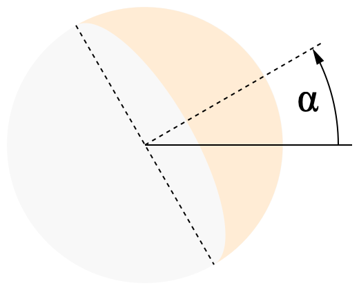

# weewx-skyfield-almanac
Almanac extension to WeeWX using Skyfield module

## Contents

* [Why should I use this extension?](#why-should-i-use-this-extension)
* [Prerequisites](#prerequisites)
* [Installation instructions](#installation-instructions)
* [Configuration instructions](#configuration-instructions)
* [Usage](#usage)
* [Help! Report creation gets very slow](#help-report-creation-gets-very-slow)
* [Customization of WeeWX using this extension](#customization-of-weewx-using-this-extension)
  * [General attributes](#general-attributes)
  * [Date and time](#date-and-time)
  * [Calendar events](#calendar-events)
  * [Heavenly bodies](#heavenly-bodies)
  * [`genVisibleTimespans()`](#genVisibleTimespans)
  * [Earth satellites](#earth-satellites)
  * [Maps](#maps)
  * [Coordinate systems](#coordinate-systems)
  * [Units](#units)
    * [Angles](#angles)
    * [Distances](#distances)
  * [Localization](#localization)
  * [How to check whether this extension is available?](#how-to-check-whether-this-extension-is-available)
* [PyEphem and Skyfield](#pyephem-and-skyfield)
* [Live data](#live-data)
* [For developers](#for-developers)
* [Base data for calculation](#base-data-for-calculation)
  * [Time scales](#time-scales)
  * [Ephemerides](#ephemerides)
  * [Apparent sizes](#apparent-sizes)
  * [Earth satellites and space debris orbital data](#earth-satellites-and-space-debris-orbital-data)
  * [Stars](#stars)
* [FAQ](#faq)
* [Credits](#credits)
* [Links](#links)

## Why should I use this extension?

PyEphem is deprecated. Its astronomical database is outdated and won't get
updated any more. It ends in 2018. Dates after that year are calculated
by extrapolation.

Skyfield is the successor of PyEphem. It is from the same author, Brandon
Rhodes. It uses more modern and more precise formulae and actual ephemerides
provided by NASA's JPL.

There is no other requirement than installing this extension to replace
PyEphem calculated values by Skyfield calculated values in existing skins.

## Prerequisites

WeeWX from version 5.2 on ist required and 
Skyfield from version 1.47 on is recommended.

Install Skyfield and NumPy. If you want to load star data you additionally
need the Pandas module, otherwise you can leave it out.

If you used the packet installation of WeeWX
this is for Debian-like distributions:

```shell
sudo apt-get install python3-numpy
sudo apt-get install python3-pandas
sudo apt-get install python3-skyfield
```

For pip-based installations this is:

```shell
source ~/weewx-venv/bin/activate
pip install numpy
pip install pandas
pip install skyfield
pip install requests
```

## Installation instructions

1) download

   ```shell
   wget -O weewx-skyfield-almanac.zip https://github.com/roe-dl/weewx-skyfield-almanac/archive/master.zip
   ```

2) run the installer

   WeeWX from version 5.2 on and WeeWX packet installation

   ```shell
   sudo weectl extension install weewx-skyfield-almanac.zip
   ```

   WeeWX from version 5.2 on and WeeWX pip installation into an virtual environment

   ```shell
   source ~/weewx-venv/bin/activate
   weectl extension install weewx-skyfield-almanac.zip
   ```
   
> [!CAUTION]
> You must not use `sudo` if you installed WeeWX by `pip`.

   In case your WeeWX installation will not have permanent Internet access
   you can append `--download-ephemeris` to the command line to download
   ephemerides during installation of the extension. This is possible from
   WeeWX 5.3 on. Please be patient when downloading ephemerides.

3) restart weewx

   for SysVinit systems:

   ```shell
   sudo /etc/init.d/weewx stop
   sudo /etc/init.d/weewx start
   ```

   for systemd systems:

   ```shell
   sudo systemctl stop weewx
   sudo systemctl start weewx
   ```

## Configuration instructions

There is no need to configure anything, but there are some tuning options
available if you have special requirements.

> [!NOTE]
> If you are new to this extension, please, do NOT change the configuration
> at the beginning. The installation sets reasonable values to all 
> configuration keys to immediately use this extension.

```
[Almanac]
    [[Skyfield]]
        # use this almanac
        enable = true
        # which ephemeris file to use
        ephemeris = de440s.bsp  # or de440.bsp or de441.bsp
        # use builtin timescale data or download it from IERS
        use_builtin_timescale = true
        # URL(s) of the timescale file (optional)
        timescale_url = '...'
        # whether to load Skyfield's built-in constellation map
        load_constellation_map = true
        # whether to log FTP responses (optional)
        log_ftp = false
        # update interval 1 year (set to 0 for no update)
        update_interval = 31557600
        # enable LOOP packet augmentation
        enable_live_data = true
        # which observation types to calculate live data for
        live_data_observations = altitude, azimuth
        # optional list of heavenly bodies
        live_data_bodies = 
        # disable the built-in PyEphem almanac (optional)
        disable_pyephem = false
        [[[EarthSatellites]]]
            file_name1 = url1
            file_name2 = url2
            ...
```

* `enable`: Enable this almanac extension
* `ephemeris`: Ephemeris (or SPICE kernel) file or a list of such files to use.
  Different files cover different scopes of heavenly bodies and/or different
  time spans. Some of those files are huge. See
  [Ephemerides](#ephemerides) and
  [Planets and their moons: JPL ephemeris files](https://rhodesmill.org/skyfield/planets.html)
  for more details. 
* `use_builtin_timescale`: Use builtin timescale data or download them
  from IERS. See [UT1 and downloading IERS data](https://rhodesmill.org/skyfield/time.html#ut1-and-downloading-iers-data)
  for details.
* `timescale_url`: an URL or a list of URLs to download the timescale file from (optional). 
  There is a default URL hardcoded in Skyfield. Unfortunately the server
  is temporarily down. That's why you can specify an alternative
  source here.
* `load_constellation_map`: Whether to load Skyfield's built-in
  constellation map (optional, default `True`)
* `log_ftp`: whether to log FTP responses of the server (optional).
  If you specified an alternative source for the timescale file in 
  `timescale_url` and that URL is at an FTP server, you can switch
  on logging of the server responses in case of trouble.
* `update_interval`: interval for updating ephemerides and timescale data
  (set to 0 to switch off updates)
* `enable_live_data`: enable live data for fast changing almanac values
  (default: on)
* `live_data_observations`: list of observation types to calculate live
  data for. Optional. Default is altitude and azimuth. Possible additional
  values are `declination` and `right ascension`.
* `live_data_bodies`: list of additional heavenly bodies to include in live 
  data (e.g. LOOP packets). Optional. The Sun is always included.
* `disable_pyephem`: disable the built-in PyEphem almanac 
  (optional, default: false).
  Sometimes enabling both the Skyfield and PyEphem almanac produces 
  special errors if the attribute or heavenly body is not available.
  In those cases setting this option may help.
* `[[[EarthSatellites]]]`: This section contains earth satellite data files
  to load. Each entry in the section contains of a file name and an URL
  The file name is used when saved to disk. You can find such files
  for example at [CelesTrak](https://celestrak.org/NORAD/elements/).
  See section [Earth satellites](#earth-satellites) for more datails.

## Usage

There is no other requirement than installing this extension to replace
PyEphem calculated values by Skyfield calculated values in existing skins.

Once the weewx-skyfield-almanac extension is installed and initialized after
startup, `$almanac.hasExtras` becomes `True` and extended almanac
information is available. Initialization can take several archive
intervals to be completed at first run after installation, depending on 
configuration.

## Help! Report creation gets very slow

If you encounter speed issues, here are some hints:

* To check if this extension is part of the problem you can set 
  `enable=false` in section `[Almanac]`, sub-section `[[Skyfield]]`, 
  in `weewx.conf`. That switches it off and switches the WeeWX built-in
  PyEphem based almanac on. Make sure, you restarted WeeWX after editing
  `weewx.conf`.
* In case you use the 
  [weewx-GTS extension](https://github.com/roe-dl/weewx-GTS)
  you need at least version 1.2 of it together with this extension.
* Calculating periods of visibility can slow down report creation.
  See section [`genVisibleTimespans()`](#genVisibleTimespans) 
  for details and solutions.
* For some attributes `almanac_time` can take a list of timestamps.
  Then, a list of respective results is returned. Using this can speed
  up things.

## Customization of WeeWX using this extension

See the WeeWX customization guide, section "The Cheetah generator",
sub-section
"[Almanac](http://weewx.com/docs/latest/custom/cheetah-generator/#almanac)",
for a detailed description how to use the almanac in WeeWX. This section
repeats some of that information and adds, what is specific to this
extension.

The general syntax is:

```
$almanac(almanac_time=time,            ## Unix epoch time
         lat=latitude, lon=longitude,  ## degrees
         altitude=altitude,            ## meters
         pressure=pressure,            ## mbars
         horizon=horizon,              ## degrees
         temperature=temperature_C     ## degrees C
       ).heavenly_body(use_center=[01]).attribute
```

If `almanac_time` is not specified, the actual time as returned by
`$current.dateTime` is used. For some attributes `almanac_time`
can take a list of timestamps.

Latitude and longitude refer to the WGS84 ellipsoid as used by GPS.
If `lat` and `lon` are not specified, the location of the station is used.

### General attributes

General attributes do not require a heavenly body. They provide general
information or are shortcuts for other attributes.

Attribute | Data type | Meaning
----------|-----------|---------
`hasExtras` | bool | becomes `True` after initialization is finished
`sunrise` | `group_time` | shortcut for `$almanac.sun.rise`
`sunset` | `group_time` | shortcut for `$almanac.sun.set`
`moon_fullness` | int | `$almanac.moon.moon_fullness` in percent rounded to integer
`moon_index` | int | moon phase index (0 to 7)
`moon_phase` | str | name of the actual moon phase in local language
`moon_phases` | list | names of the moon phases in local language

Additionally this WeeWX almanac extension provides the following general
attributes:

Attribute | Data type | Meaning
----------|-----------|--------
`venus_index` | int | venus phase index (0 to 7)
`venus_phase` | str | name of the actual venus phase
`mercury_index` | int | mercury phase index (0 to 7)
`mercury_phase` | str | name of the actual mercury phase

### Date and time

Date and time values do not require a heavenly body. They refer to the
location on Earth that `$almanac` is bound to. You can specify the
location by parameters to `$almanac`. If you do not set them, the
location of the station is used.

WeeWX datatype   | Pure float result | Meaning
-----------------|-------------------|----------------
`sidereal_angle` | `sidereal_time`   | Local Apparent Sidereal Time
`solar_angle`    | `solar_time`      | Local Apparent Solar Time
`solar_datetime` | &mdash;           | true local solar date and time
`datetime`       | &mdash;           | time `$almanac` is bound to as timezone time based on UTC
`dut1`           | &mdash;           | difference between UT1 and UTC, typically less than one second
`delta_t`        | &mdash;           | difference between TT and UT1
`equation_of_time` | &mdash; | equation of time according to USNO definition: EoT=LAT-LMT (apparent solar time minus mean solar time)
`legacy_equation_of_time` | &mdash; | equation of time, historical and french: EoT=LMT-LAT (mean solar time minus apparent solar time)

Note: The tags `$almanac.sidereal_angle`, `$almanac.sidereal_time`,
`$almanac.solar_angle`, and `$almanac.solar_time` return a value
in decimal degrees rather than the more customary value from 0 to
24 hours.

Solar time is the time a sundial would show.

If you do not install this extension together with Skyfield but use PyEphem,
which is supported by core WeeWX, `sidereal_angle` and `sidereal_time` are
available only.

### Calendar events

Calendar events do not require a heavenly body. They refer to Earth.
This extension provides the events described in the WeeWX customization
guide, but calculated using Skyfield. They happen independent of your
location on Earth at the same instant all over the world. The local time
differs only. Here is a list of available events:

Previous event | Next event |
---------------|------------|
`previous_equinox` | `next_equinox`
`previous_solstice` | `next_solstice`
`previous_autumnal_equinox` | `next_autumnal_equinox`
`previous_vernal_equinox` | `next_vernal_equinox`
`previous_winter_solstice` | `next_winter_solstice`
`previous_summer_solstice` | `next_summer_solstice`
`previous_new_moon` | `next_new_moon`
`previous_first_quarter_moon` | `next_first_quarter_moon`
`previous_full_moon` | `next_full_moon`
`previous_last_quarter_moon` | `next_last_quarter_moon`

And these events this WeeWX extension provides additionally:

Previous event | Next event | Meaning
---------------|------------|------------------
`previous_perihelion` | `next_perihelion` | perihelion of the Earth (when the Earth is nearest to the Sun)
`previous_aphelion` | `next_aphelion` | aphelion of the Earth (when the Earth is farthest from the Sun)
`previous_perigee_moon` | `next_perigee_moon` | perigee of the Moon (when the Moon is nearest to the Earth; in connection with full moon sometimes "supermoon")
`previous_apogee_moon` | `next_apogee_moon` | apogee of the Moon (when the Moon is farthest from the Earth)
`previous_new_venus` | `next_new_venus` | maximum of phase angle; Venus changes from evening to morning side
`previous_first_quarter_venus` | `next_first_quarter_venus` | waxing 90 degrees of phase angle
`previous_full_venus` | `next_full_venus` | minimum of phase angle
`previous_last_quarter_venus` | `next_last_quarter_venus` | waning 90 degrees of phase angle

Example:
```
$almanac.next_solstice
```

### Heavenly bodies

This extension provides the attributes described in the WeeWX customization 
guide, but calculated using Skyfield. Additionally it provides some
extra attributes, that are not available with PyEphem.

The Sun as well as planets and their moons are referenced by their name.
Depending on the ephemerides you chose you may be required to add
`_barycenter` to the name of a heavenly body to get results
(for example `jupiter_barycenter`). Stars are referenced by their
Hipparcos catalog number preceded by `HIP` (for example `HIP87937` for
Barnard's Star). Some wellknown stars can also be referenced by their
name.

These events are supported for heavenly bodies in reference to the 
location and the timestamp specified:

Day of timestamp | Previous event | Next event | Meaning
------|----------------|------------|----------
`rise` | `previous_rising` | `next_rising` | rising of the body above the horizon
`transit` | `previous_transit` | `next_transit` | when the body transits the meridian
`set` | `previous_setting` | `next_setting` | setting of the body above the horizon
`antitransit` | `previous_antitransit` | `next_antitransit` | antitransit
`visible` | &mdash; | &mdash; | how long the body will be visible
`visible_change` | &mdash; | &mdash; | change in visbility compared to previous day

Example:
```
$almanac.sun.rise
```

> [!CAUTION]
> It is possible that a heavenly body does not rise, transit, or set at
> all on a particular day.

Here is the list of attributes provided by this extension but not by
core WeeWX using PyEphem:

WeeWX datatype | Pure float result | Meaning
---------------|-------------------|----------------
`astro_dist`   | `a_dist`          | astrometric geocentric distance
`geo_dist`     | `g_dist`          | apparent astrometric geocentric distance
`topo_dist`    | `dist`            | apparent topocentric distance 
`alt_distance` | `alt_dist`        | distance in reference to the coordinate system of altitude and azimuth
`hour angle`   | `ha`              | topocentric hour angle
`ha_declination` | `ha_dec`        | declination in reference to the coordinate system of the hour angle
`ha_distance`  | `ha_dist`         | distance in referenc to the coordinate system of the hour angle
`day_max_altitude` | `day_max_alt` | maximum altitude of the day
`day_max_alt_time` | &mdash;       | timestamp of the maximum altitude of the day
`moon_tilt` | &mdash; | crescent moon tilt angle (0 = illuminated side to the right on northern hemisphere, π = illuminated side to the left on northern hemisphere <br />
`parallactic_angle` | &mdash; | parallactic angle
&mdash; | `hip_number` | in case of stars the Hipparcos catalog number
&mdash; | `venus_fullness` | percentage of Venus that is illuminated
&mdash; | `mercury_fullness` | percentage of Mercury that is illuminated
&mdash; | `constellation` | name of the constellation the actual position of the body is in; in local language if available, otherwise in latin
&mdash; | `constellation_abbr` | abbrevation of the constellation the actual position of the body is in

And these attributes are supported by both core WeeWX using PyEphem and
this extension using Skyfield:

WeeWX datatype | Pure float result | Meaning
---------------|-------------------|----------------
`azimuth` | `az` | apparent azimuth of the body in the sky
`altitude` | `alt` | apparent altitude of the body in the sky
`astro_ra` | `a_ra` | astrometric geocentric right ascension
`astro_dec` | `a_dec` | astrometric geocentric declination
`geo_ra` | `g_ra` | apparent geocentric right ascension
`geo_dec` | `g_dec` | apparent geocentric declination
`topo_ra` | `ra` | apparent topocentric right ascension
`topo_dec` | `dec` | apparent topocentric declination
`elongation` | `elong` | angle with Sun
`hlatitude` | `hlat` | astrometric heliocentric latitude
`hlongitude` | `hlon` | astrometric heliocentric longitude
`sublatitude` | `sublat` | latitude below an earth satellite
`sublongitude` | `sublong` | longitude below an earth satellite
&mdash; | `elevation` | elevation of an earth satellite above the ellipsoid
&mdash; | `earth_distance` | astrometric distance to the Earth in astronomic units (AU)
&mdash; | `sun_distance` | astrometric distance to the Sun in astronomic units (AU)
&mdash; | `mag` | magnitude
&mdash; | `name` (str) | language independent name of the celestial object
&mdash; | `size` | diameter in arcseconds
`radius_size` | `radius` | radius in radians
&mdash; | `moon_fullness` | percentage of the Moon surface that is illuminated

Note that `name`, `ha` and `parallactic_angle` are available with PyEphem, 
too, but undocumented. For that reason the result is not really the same.
`ha` of PyEphem is in the range 0 to 360°, `ha` of Skyfield -180° to +180°.
`parallactic_angle` of PyEphem is a PyEphem angle, `parallactic_angle` of
Skyfield is a WeeWX data type.

Try

```
#import user.skyfieldalmanac
#set $keys = [key for key in user.skyfieldalmanac.ephemerides]
$keys
```

if you look for a list of names available as heavenly body.

`$almanac.planets` provides a list of available planets. If you want to
display a table of the planets and their data you could do it that way:

```
    #from weewx.units import ValueTuple, ValueHelper
    <p>
    <table>
    <tr>
    <th>$gettext('Planet')</th>
    <th>$pgettext('Astronomical','Altitude')</th>
    <th>$gettext('Azimuth')</th>
    <th>$gettext('Right ascension')</th>
    <th>$gettext('Declination')</th>
    <th>$gettext('Distance')</th>
    <th>$gettext('Magnitude')</th>
    <th>$gettext('Rise')</th>
    <th>$gettext('Set')</th>
    <th>$gettext('Distance from Sun')</th>
    <th>
    </tr>
    #for $planet in $almanac.planets
    #set $binder = $getattr($almanac,$planet)
    <tr>
    <td>$binder.name</td>
    <td style="text-align:right">$binder.altitude</td>
    <td>$binder.azimuth $binder.azimuth.ordinal_compass</td>
    #set $ra_vh = $ValueHelper(ValueTuple($binder.topo_ra.raw/15.0 if $binder.topo_ra.raw is not None else None,None,None),'day',formatter=$station.formatter)
    <td style="text-align:right">$ra_vh.format("%.1f") h</td>
    <td style="text-align:right">$binder.topo_dec</td>
    <td style="text-align:right">$binder.topo_dist</td>
    #set $mag_vh = $ValueHelper(ValueTuple($binder.mag,None,None),'day',formatter=$station.formatter)
    <td style="text-align:right">$mag_vh.format("%.1f")</td>
    <td>$binder.rise</td>
    <td>$binder.set</td>
    #set sund_vh = $ValueHelper(ValueTuple($binder.sun_distance,None,None),'day',formatter=$station.formatter)
    <td>$sund_vh.format("%.2f") AU</td>
    </tr>
    #end for
    </table>
    </p>
```

If you want to have the names of the planets in your local language, put
them in the language file of your skin in section `[[Almanac]]` 
as a list of names to the key `planet_names`.

### `genVisibleTimespans()`

`genVisibleTimespans()` is a generator function that returns a series
of timespans, each of them representing one period of visibility of the
heavenly body. You can use it in `#for` loops.

The method takes three optional parameters:
* `context`: If you provide the name of a timespan like `week`, `month`,
   or `year` the visibility periods are calculated for the respective
   timespan `almanac_time` is in.
* `timespan`: You can provide a timespan directly. `almanac_time` is
  ignored in this case.
* `archive`: A database manager to get temperature and pressure from
  for adjusting rising and setting time according to refraction.
  You can set this parameter to `$day.db_lookup('wx_binding')`
  to use the actual measurements.

If you wonder why you could not use a loop over the days as the tags
`$week.days`, `$month.days`, and `$year.days` provide and then
calculate rising and setting time, here is the answer: You can do so
with PyEphem, but unfortunately this approach is 125 times slower
with Skyfield. Therefore a specialized method is required.

Also, this method also works for the Moon and the planets, which do
not always rise and set once a day.

If you look for tags to calculate aggregations over the light day
using this function, see the
[weewx-GTS](https://github.com/roe-dl/weewx-GTS) extension, which
provides `$daylight`, `$LMTweek.daylights`, `$LMTmonth.daylights`, and
`$LMTyear.daylights`, which you can use like `$week.days`, `$month.days`,
and `$year.days` but for the light day instead of the whole day.

### Earth satellites

What is said about [Heavenly bodies](#heavenly-bodies) generally applies
to earth satellites, too. Here is some special information for that kind
of heavenly objects.

To get information of an earth satellite you first have to load an ephemerides 
file. For example, if you want the position of weather satellites, use

```
            weather.tle = https://celestrak.org/NORAD/elements/gp.php?GROUP=weather&FORMAT=tle
```

When that file is successfully loaded and processed you can refer to a
satellite out of it by concatenating the name of the file (this time
`weather`), an underscore, and the catalog number of the satellite. For 
example, for the METEOSAT-10 satellite this would be `weather_38552`. 
Then, if you want to see the location on Earth directly below the 
satellite you would write

```
Latitude: $almanac.weather_38552.sublatitude.format("%.3f")
Longitude: $almananc.weather_38552.sublongitude.format("%.3f")
```

Please note that this one is a geostationary satellite. So the position
varies a little bit only. You see it if you format the output with 
decimals as shown above.

See section [Heavenly bodies](#heavenly-bodies) for more attributes to use.

This example prints a list of all space stations with their actual
positions:

```
    #import user.skyfieldalmanac
    <table>
    <tr>
    <th>Station</th>
    <th>$pgettext('Astronomical','Altitude')</th>
    <th>$gettext('Azimuth')</th>
    <th>$gettext('Right ascension')</th>
    <th>$gettext('Declination')</th>
    <th>$gettext('Distance')</th>
    <th>$gettext('Latitude')</th>
    <th>$gettext('Longitude')</th>
    </tr>
    #for $key in [key for key in user.skyfieldalmanac.ephemerides if key.startswith('stations_')]
    #set $binder = $getattr($almanac,$key)
    <tr>
    <td>$binder.name</td>
    <td style="text-align:right">$binder.altitude</td>
    <td>$binder.azimuth $binder.azimuth.ordinal_compass</td>
    #set $ra_vh = $ValueHelper(ValueTuple($binder.topo_ra.raw/15.0 if $binder.topo_ra.raw is not None else None,None,None),'day',formatter=$station.formatter)
    <td style="text-align:right">$ra_vh.format("%.1f") h</td>
    <td style="text-align:right">$binder.topo_dec</td>
    <td style="text-align:right">$binder.topo_dist</td>
    <td style="text-align:right">$binder.sublatitude</td>
    <td style="text-align:right">$binder.sublongitude</td>
    </tr>
    #end for
    </table>
```

In `weewx.conf` you need

```
            stations.tle = https://celestrak.org/NORAD/elements/gp.php?GROUP=stations&FORMAT=tle
```

in sub-section `[[[EarthSatellites]]]` for this to work.

### Maps

If you want to draw sky maps you may want to install the
[WeeWX sky map extension](https://github.com/roe-dl/weewx-skymap-almanac).

### Coordinate systems

There are different coordinate systems used to express locations.

Within base plane | Rectangular to it | Base plane  | Origin | Direction
-----------|--------------|-------------|--------|-------------
longitude (-180°...+180°) | latitude (-90°...+90°) | Earth's equator | Earth's center | meridian of Greenwich
azimuth (0°...360°) | altitude (-90°...+90°) | horizon of the observer | observer | geographic north
right ascension (0°...360°) | declination (-90°...+90°) | Earth's equator | Earth's center | Sun at spring equinox
hour angle (-180°...+180°) | declination (-90°...+90°) | Earth's equator | Earth's center | observer's meridian

Please note, that the Earth's equator also moves in different ways, and
the attributes differ in which of the movements they take care of.

And those changes are also the reason you have to provide a date, called
*epoch*, along with the coordinates to fully specify a location in space.
For calculating apparent geocentric and topocentric right ascension and
declination this extension uses `almanac_time` for the epoch.

The hour angle and its declination are calculated using polar motion data
if available. `ha_declination` (`ha_dec`) is thus slightly different from
`topo_dec` (`dec`).

### Units

#### Angles

While WeeWX 4.X only knew one unit for angles, `degree_compass`, there 
are more of them in WeeWX 5.X. `degree_compass` ist still there, but
additionally there are `degree_angle` and `radian`.

The same applies to unit groups. There was `group_direction`, which refers
to the compass direction, and now there is also `group_angle`, which is
used for altitude and declination. In WeeWX extensions you also find
`group_coordinate`, which refers to the geographic coordinates latitude
and longitude.

Despite the compass direction originates at north, the unit `degree_compass`
is used for other angles with other origins within WeeWX, too. They only have 
in common that they are measured within the base plane of the respective 
coordinate system.

#### Distances

In Astronomy huge distances are measured. To express them astronomers use
special units:

Unit | Unit label | Name              | Unit group       | Definition                    | Example
-----|------------|-------------------|------------------|-------------------------------|------------------------------------------
`light_year` | ly | light-year        | `group_distance` | 1 ly = 9,460,730,472,580.8 km | `$almanac.HIP32349.topo_dist.light_year`
`AU`         | AU | astronomical unit | `group_distance` | 1 AU = 149,597,870.7 km       | `$almanac.jupiter_barycenter.geo_dist.AU`
`gigameter`  | Gm | million kilometer | `group_distance` | 1 Gm = 10<sup>6</sup> km      | `$almanac.sun.astro_dist.gigameter`

### Localization

To adapt skins to local languages, WeeWX uses language files. These files
include an `[Almanac]` section that contains at least one key called 
`moon_phases`. This WeeWX almanac extension also uses the value of that key 
to name the moon phases.

The same applies to compass directions which come from `directions` in
section `[Units]`, sub-section `[[Ordinates]]`.

If there are no language files in your skin, look into `skin.conf` for
those sections and keys. If even there they are missing, they could be
found within `weewx.conf` in section `StdReport`.

As this extension provides additional attributes, additional localization
data is required, too. The following keys are used:

* `venus_phases`: The same as moon phases but for Venus.
* `mercury_phases`: The same as moon phases but for Mercury.
* `planet_names`: List of the names of the planets of the solar system,
  sorted by their distance to the Sun, including Earth and Pluto.

Put those keys into the `Almanac` section of the appropriate language
file of your skin.

Please note, that there is no difference in the names of the phases of
Moon, Venus, and Mercury in English, but in other languages.

You can also use those keys as parameters to the `$almanac` tag.

### How to check whether this extension is available?

If you write a skin, you may want to know whether the user installed and
enabled this extension or not. You can do so this way:

```
#import weewx.almanac
## get a list of the names of the installed almanac extensions
#set $almanac_names = [$alm.__class__.__name__ for $alm in $weewx.almanac.almanacs]
## check if the Skyfield almanac extension is available
#set $skyfield_almanac_available = 'SkyfieldAlmanacType' in $almanac_names and $almanac.hasExtras
```

Then you include and exclude code by using `#if $skyfield_almanac_available`.

If you simply want to know whether a certain extended attribute is
available, you can do so by using `$varExists` like in this example:

```
#if $varExists("almanac.sun.max_altitude")
... $almanac.sun.max_altitude.format("%.1f") ...
#end if
```

Please note, that the `$varExists` method works with attributes of heavenly bodies only.

## PyEphem and Skyfield

If you install both PyEphem and Skyfield, Skyfield is preferred. If the
given heavenly body is available with Skyfield, the attribute is calculated
using Skyfield. Otherwise PyEphem is tried. If neither Skyfield nor 
PyEphem know about the body, an exception is raised.

## Live data

Some skins do not only update the web pages once every archive interval
but present live data out of LOOP packets. This extension can add fast 
changing almanac values to the LOOP packet for live updates. To use them
include them in MQTT output. To activate live data, set the
`enable_live_data` configuration option to `true`, which is the default.

* `solarAltitude`: current altitude of the Sun
* `solarAzimuth`: current azimuth of the Sun
* `solarTime`: current hour angle of the Sun, counted from midnight
  (that is sundial time)
* `solarPath`: current percentage of the way of the Sun from sunrise
  to sunset
* `solarDeclination`: current declination of the Sun (available if
  the configuration option `live_data_observations` include
  `declination` or `right ascension`)
* `solarRightAscension`: current right ascension of the Sun (available if
  the configuration option `live_data_observations` include
  `declination` or `right ascension`)

What is the difference between `solarAzimuth`, `solarAltitude` and
`$almanac.sun.az` (`$almanac.sun.azimuth`), `$almanac.sun.alt`
(`$almanac.sun.azimuth`), respectively?

* `solarAzimuth` and `solarAltitude` are included in LOOP packets and 
  output to MQTT and thus allow live updates on web sites.
* As `solarAzimuth` and `solarAltitude` are observation types, they can be 
  saved to the database and then displayed in diagrams.

If you want to use those values for further calculations - for example
for sunshine duration calculation - make sure to put 
`user.skyfieldalmanac.LiveService` in the list of data services before 
the module that uses the values.

For mobile stations the location is updated from `latitude` and `longitude`
observation types if they are present in the LOOP packet.

If you set `live_data_bodies` to a list of heavenly bodies, then their
values are calculated, too. For example, if that
list contains `moon`, the observation types `lunarAzimuth`, `lunarAltitude`,
`lunarRightAscension`, and `lunarDeclination` are available. The same applies
if the list contains `mars_barycenter`, this time with the prefix `mars`.

If you want to save those values to the database, you have to add columns
using the 
[`weectl` utility](https://weewx.com/docs/latest/utilities/weectl-database/#add-a-new-observation-type-to-the-database).
For example, if you want to include `solarAltitude` to the database use the 
following command:

in case of a WeeWX packet installation:

```shell
sudo weectl database add-column solarAltitude
```

in case of a WeeWX pip installation:

```shell
source ~/weewx-venv/bin/activate
weectl database add-column solarAltitude
```

## For developers

Not only the WeeWX almanac itself is extensible. If you are a developer
you can also write a WeeWX extension, that adds new attributes to heavenly
bodies covered by this extension. To do so write an almanac extension
and append a reference to it to `user.skyfieldalmanac.subalmanacs`.

Within your extension you need to define a class based on
`weewx.almanac.AlmanacType` with a method 
`get_almanac_data(self, almanac_obj, attr)` in it.
`attr` passes the attribute out of the template. For all attributes
you want to support, do the calculation and return a `ValueHelper`.
For attributes you do not support, raise `weewx.UnknownType(attr)`.
`almanac_obj` provides the following information:
* `almanac_obj.heavenly_body`: the name of the heavenly body. 
* `almanac_obj.almanac.time_ts`: the timestamp `$almanac` is bound to.
  It may be a list, in which case you have to do your calculation
  for all the timestamps provided.
* `almanac_obj.almanac.lat`: latitude
* `almanac_obj.almanac.lon`: longitude
* `almanac_obj.almanac.texts`: the `[Almanac]` section out of the language
  file

## Base data for calculation

Astronomic calculations require two kinds of base data: time scales and
ephemerides. Both are subject to regular updates due to new measurements
and/or scientific findings. Therefore Skyfield allows for downloading new 
versions of those data. Once downloaded the files are re-used every
time WeeWX starts.

The files are located in `SQLITE_ROOT`, which is defined in `weewx.conf` in
section `[DatabaseTypes]`, sub-section `[[SQLite]]`.

### Time scales

The Earth does not rotate steadily and additionally slows down by time.
This has to be taken into account when doing astronomic computations.
Earth rotation is documented and published by the IERS, an international 
organization (see link below). Skyfield comes with an internal list of
time scale data (which of course gets out of date by time) or can use
a file downloaded from IERS. Set the configuration option 
`use_builtin_timescale` to `true` if you want to use the internal
time data or to `false` if you want to use the external file called
`finals2000A.all`.

Astronomers know different time scales. Some of them depend on
earth rotation (like UTC and UT1) and others do not (like TAI, TT,
and TDB). The relation between those timescales are defined in
the file mentioned above.

Additionally that file contains information about polar motion, which
is used for calculating the hour angle and the depending declination.

### Ephemerides

There are no built-in ephemerides. You have to provide an ephemeris file
or a list of such files or let this extension download it from JPL or 
another source. Such files are commonly called "SPICE kernels".

The commonly used ephemeris file `de440.bsp` covers the following
astronomic objects:

```
SPICE kernel file 'de440.bsp' has 14 segments
  JD 2287184.50 - JD 2688976.50  (1549-12-30 through 2650-01-24)
      0 -> 1    SOLAR SYSTEM BARYCENTER -> MERCURY BARYCENTER
      0 -> 2    SOLAR SYSTEM BARYCENTER -> VENUS BARYCENTER
      0 -> 3    SOLAR SYSTEM BARYCENTER -> EARTH BARYCENTER
      0 -> 4    SOLAR SYSTEM BARYCENTER -> MARS BARYCENTER
      0 -> 5    SOLAR SYSTEM BARYCENTER -> JUPITER BARYCENTER
      0 -> 6    SOLAR SYSTEM BARYCENTER -> SATURN BARYCENTER
      0 -> 7    SOLAR SYSTEM BARYCENTER -> URANUS BARYCENTER
      0 -> 8    SOLAR SYSTEM BARYCENTER -> NEPTUNE BARYCENTER
      0 -> 9    SOLAR SYSTEM BARYCENTER -> PLUTO BARYCENTER
      0 -> 10   SOLAR SYSTEM BARYCENTER -> SUN
      3 -> 301  EARTH BARYCENTER -> MOON
      3 -> 399  EARTH BARYCENTER -> EARTH
      1 -> 199  MERCURY BARYCENTER -> MERCURY
      2 -> 299  VENUS BARYCENTER -> VENUS
```

Moons of planets other than the Earth you find at JPL's site in the
directory "satellites". Ceres and other dwarf planets you find
there in the directory "asteroids". 

### Apparent sizes

Unlike PyEphem Skyfield does not contain a method to calculate the 
apparent size of a heavenly body. Therefore the files of this WeeWX 
extension include a dictionary providing equatorial, polar, and mean radius 
(in kilometres) of the Sun, the Moon, Mercury, Venus, the Earth, Mars, 
Ceres, Jupiter, Saturn, Uranus, Neptune, and Pluto. For those bodies 
the attributes `size` and `radius` are available.

### Earth satellites and space debris orbital data

The orbital data of earth satellites are published as so-called
TLE files. Their name comes from "two line element" and refers to the
ancient two punched cards originally used for that data.
The main source of such files is the
[CelesTrak](https://celestrak.org) site. Another source is
[SPACE-TRACK](https://www.space-track.org) of USSPACECOM, but it
requires registration. TLEs for the weather satellites of EUMETSAT
you find at [their website](https://service.eumetsat.int/tle/).

Orbital data of earth satellites regularly become out of date very fast. It 
is no use to calculate the positions of such satellites without updating the 
files every day. Therefore this extension sets the download interval for 
those files to one day regardless of the download interval set in
configuration for the ephemeris files.

The object identification number is unique. The only reason it is 
connected to the file name here is to make it possible to use one
single format specification for a whole set of satellites.

### Stars

From 1989 to 1993 ESA's Hipparcos satellite imaged the celestial sphere,
and afterwards a new high accuracy star catalogue was calculated and
published, called the Hipparcos catalogue. It contains 118218 stars from all 
over the sky. Skyfield can download and use that catalogue and so can
this WeeWX extension. The URL is included in Skyfield. No configuration
is required so far.

## FAQ

Q: I installed the Skyfield module, but no extended almanac values
   are displayed.

A: Depending on the ephemeris file you chose initialization takes more or
   less time. While it is not finished, the skin displays some core
   values only. Wait a moment, and the extended values will show up.
   If the ephemeris file is huge and it is the first run after
   installation, it can take several archive intervals to be completed.


Q: Which ephemeris file should I use?

A: The ephemeris files differ in size and coverage of heavenly bodies and
   time. The default, if you do not choose anything, is `de440s.bsp`. It
   covers Sun, Earth, Moon, and some data of the long known planets. If
   you need more, try `de440.bsp` or even `de441.bsp`.
   From time to time the NASA releases new sets of ephemeris files. Then you
   can try the new edition.
   See [Planets and their moons: JPL ephemeris files](https://rhodesmill.org/skyfield/planets.html)
   for more details.


Q: Are there disadvantages of Skyfield?

A: Yes. Always are. Skyfield depends on NumPy, while PyEphem does not.


Q: How do I have to adapt my skin to use this extension?

A: There is nothing to do. Installing this extension is enough. But you
   could add the additional attributes supported by this extension
   to your skin to display them there.


Q: I installed a skin and it does not show the localized names of planets
   and constellations.

A: You will have to re-install this extension after you installed the
   skin. 


Q: I get the log message "ERROR user.skyfieldalmanac: live almanac error:
   'mars'" What can I do?

A: Try "mars_barycenter" instead of "mars".


Q: What can I do if I don't want the skins' language files augmented with
   astronomic terms from this extension?

A: Unfortunately there is no direct way to do so, but there is a workaround. 
   You can unpack the downloaded ZIP file, which will create a directory
   `weewx-skyfield-almanac-master`. Within that directory you can remove 
   the `lang` directory, and then install the extension from 
   the `weewx-skyfield-almanac-master` directory.

## Credits

* [Tom Keffer et al. (WeeWX)](https://github.com/weewx/weewx)
* [Brandon Rhodes (Skyfield)](https://github.com/skyfielders/python-skyfield)

## Links

* [WeeWX](https://weewx.com)
* [Skyfield](https://rhodesmill.org/skyfield/)
* [WeeWX sky map extension](https://github.com/roe-dl/weewx-skymap-almanac)
* [International Earth Rotation and Reference Service IERS](https://iers.org)
  (provides the timescale file `finals2000A.all`)
* [Jet Propulsion Laboratory JPL](https://www.jpl.nasa.gov)
  (provides the ephemeris files)
* [Issue #981: PyEphem is deprecated](https://github.com/weewx/weewx/issues/981)
* [International Terrestrial Reference System ITRS](https://en.wikipedia.org/wiki/International_Terrestrial_Reference_System_and_Frame)
* [ESA's Hipparcos mission and catalog](https://www.cosmos.esa.int/web/hipparcos/home)
* [The brightest stars in the Hipparcos catalogue](https://www.cosmos.esa.int/web/hipparcos/brightest)
* [CelesTrak](https://celestrak.org)
* [Andrea K. Myers-Beaghton et al.: The moon tilt illusion](https://www.seas.upenn.edu/~amyers/MoonPaperOnline.pdf)
* [Karlheinz Schott (&dagger;): "Falsche" Mondneigung - Wohin zeigt die Mondsichel?](https://falsche-mondneigung.jimdofree.com/b-geometrische-darstellung-und-berechnung/) (german)
